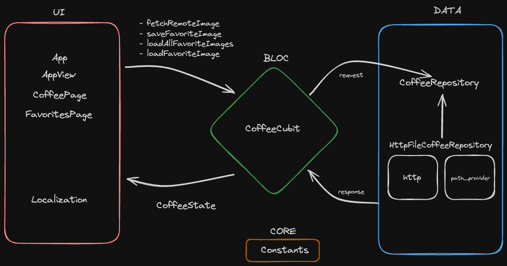

# Coffee App

![coverage][coverage_badge]
[![style: very good analysis][very_good_analysis_badge]][very_good_analysis_link]
[![License: MIT][license_badge]][license_link]

An app that lets users save their favorite coffee images for offline viewing, built to showcase my development skills for the Very Good Ventures recruitment process. Created with the [Very Good CLI][very_good_cli_link] 🤖.

---

## Table of Contents
- [Getting Started](#getting-started)
- [Architecture Overview](#architecture-overview)
- [Folder Structure](#folder-structure)
- [Layered Architecture in Detail](#layered-architecture-in-detail)
  - [UI Layer](#ui-layer-appview-and-coffeeview)
  - [Business Logic Layer](#business-logic-layer-coffeecubit)
  - [Data Layer](#data-layer-coffeerepositories-and-coffeemodels)
  - [Core Layer](#core-layer-core)
  - [Localization](#localization-l10n)
  - [App initialization](#app-initialization-bootstrapdart-and-main-files)
- [Design Decisions](#design-decisions)
- [Running Tests](#running-tests)
- [Working with Translations](#working-with-translations)
  - [Adding Strings](#adding-strings)
  - [Adding Supported Locales](#adding-supported-locales)
  - [Adding Translations](#adding-translations)
  - [Generating Translations](#generating-translations)

---

## Getting Started

This project contains 3 flavors:

- development
- staging
- production

To run the desired flavor either use the launch configuration in VSCode/Android Studio or use the following commands:

```sh
# Development
$ flutter run --flavor development --target lib/main_development.dart

# Staging
$ flutter run --flavor staging --target lib/main_staging.dart

# Production
$ flutter run --flavor production --target lib/main_production.dart
```

_\*Coffee App works on iOS, Android, Web, and Windows._

---

## Architecture Overview

The app is divided into several layers and modules, each with a dedicated purpose. This architecture separates UI components, business logic, and data management, ensuring that each part of the app is independent and easily testable. The main layers and their purposes are:



- **UI Layer (Views)**
- **Business Logic Layer (Cubit and State Management)**
- **Data Layer (Repositories and Models)**
- **Core Layer (Constants and Utilities)**

### Folder Structure

The folder structure follows a clean, modular approach. Each main feature is separated by folders that represent the core app, individual features (like `coffee`), and supporting files.

```
- app
  - view
    - app.dart
    - app_view.dart
- coffee
  - cubit
    - coffee_cubit.dart
    - coffee_state.dart
  - exceptions
    - exceptions.dart
  - models
    - coffee_image.dart
  - repositories
    - http_file_coffee_repository
      - http_file_coffee_repository.dart
    - models
      - api_coffee_image_model.dart
    - coffee_repository.dart
  - view
- core
  - constants.dart
- l10n
  - arb
    - app_en.arb
    - app_pt.arb
- bootstrap.dart
- main_development.dart
- main_production.dart
- main_staging.dart
```

### Layered Architecture in Detail

#### UI Layer: `app/view` and `coffee/view`

The `view` folder under each module (such as `app/view` and `coffee/view`) contains the UI components of the app. This layer includes widgets that are designed to be lightweight and free of business logic, delegating that responsibility to the **Bloc** architecture.

- `app.dart` and `app_view.dart` set up the main structure and navigation of the app, including all the `Material` attributes.
- `coffee/view` includes widgets specific to the coffee module, following Clean Code principles by focusing on composability and reusability.

#### Business Logic Layer: `coffee/cubit`

The `cubit` folder is where the business logic and state management occur. Using the **Cubit** `flutter_bloc` allows us to:
- Maintain a **reactive and declarative** approach to handling state.
- Ensure that state management is isolated, making it easier to test.
- Encourage **unidirectional data flow**, which keeps the state consistent across the app.

This layer includes:
- `coffee_cubit.dart`: Manages the business logic for coffee image fetching, caching, and updating the state.
- `coffee_state.dart`: Defines various states for the coffee images, including loading, success, and error states.

Bloc architecture allows us to create a predictable data flow, essential for debugging, especially when working with complex UI updates or asynchronous data loading.

#### Data Layer: `coffee/repositories` and `coffee/models`

The Data Layer is responsible for data retrieval and manipulation. By following **Dependency Inversion** and **Single Responsibility** principles, this layer is separated from the business logic, making it easy to swap out data sources without affecting the rest of the app.

- **Repositories**:
  - `coffee_repository.dart` (abstract class): This interface defines the contract for coffee data retrieval, ensuring consistency across different implementations.
  - `http_file_coffee_repository.dart`: Implements the repository interface to fetch data from the HTTP API with `http` package, saving the files locally using `path_provider` package.
  
  Repositories are a fundamental part of **Clean Architecture** as they abstract the data sources, allowing the app to easily switch between implementations or test with mock data.

- **Models**:
  - `coffee_image.dart`: Defines the data model for coffee images, which serves as the core entity for the coffee feature.
  - `api_coffee_image_model.dart`: Represents the API response model, which is transformed into a `coffee_image` for use in the app.

Having separate models for API responses and core entities is essential to isolate the business logic from the API structure. This approach follows the **Data Transfer Object** (DTO) pattern, improving adaptability and future-proofing the app.

#### Core Layer: `core`

The `core` folder contains globally used constants. By centralizing this information, the app becomes more maintainable and avoids hardcoding values in multiple places.

- `constants.dart`: Stores constant values that are used throughout the app.

#### Localization: `l10n`

The `l10n` folder contains the localization files from the `Very Good CLI` approach, which allow the app to support multiple languages.

- `.arb` files (such as `app_en.arb` and `app_pt.arb`) define the strings used in the app for English and Portuguese, following **internationalization (i18n)** standards, coming from `flutter_localizations` package.

### App initialization: `bootstrap.dart` and main files

The `bootstrap.dart` file sets up essential configurations and initializes the app with specific setups for different environments (`main_development.dart`, `main_production.dart`, `main_staging.dart`). This is a very good benefit of using `Very Good CLI` as template to start the app.

These entry points allow the app to be built with different configurations, depending on the target environment. This setup promotes flexibility, enabling better testing, debugging, and production builds.

## Design Decisions

### Clean Architecture and Bloc

- **Separation of Concerns**: Using Clean Architecture with Bloc ensures that the app's state management, data handling, and UI rendering are isolated. This approach allows each part of the app to be tested independently, which leads to more reliable and maintainable code.

- **Declarative State Management**: Bloc provides a declarative way of handling state, making it easier to debug and reducing the chances of unpredictable state mutations.

- **Reusability**: By decoupling the app’s logic and UI, widgets become more reusable, adhering to Clean Code principles and facilitating feature extensions and maintenance.

---
## Running Tests

To run all unit and widget tests use the following command:

```sh
$ flutter test --coverage --test-randomize-ordering-seed random
```

To view the generated coverage report you can use [lcov](https://github.com/linux-test-project/lcov).

```sh
# Generate Coverage Report
$ genhtml coverage/lcov.info -o coverage/

# Open Coverage Report
$ open coverage/index.html
```

---

## Working with Translations

This project relies on [flutter_localizations][flutter_localizations_link] and follows the [official internationalization guide for Flutter][internationalization_link].

### Adding Strings

1. To add a new localizable string, open the `app_en.arb` file at `lib/l10n/arb/app_en.arb`.

```arb
{
    "@@locale": "en",
    "appBarTitle": "Coffee App",
    "@appBarTitle": {
        "description": "Text shown in the AppBar of the Coffee Page"
    }
}
```

2. Then add a new key/value and description

```arb
{
    "@@locale": "en",
    "appBarTitle": "Coffee App",
    "@appBarTitle": {
        "description": "Text shown in the AppBar of the Coffee Page"
    },
    "helloWorld": "Hello World",
    "@helloWorld": {
        "description": "Hello World Text"
    }
}
```

3. Use the new string

```dart
import 'package:coffee_app/l10n/l10n.dart';

@override
Widget build(BuildContext context) {
  final l10n = context.l10n;
  return Text(l10n.helloWorld);
}
```

### Adding Supported Locales

Update the `CFBundleLocalizations` array in the `Info.plist` at `ios/Runner/Info.plist` to include the new locale.

```xml
    ...

    <key>CFBundleLocalizations</key>
	<array>
		<string>en</string>
		<string>pt</string>
	</array>

    ...
```

### Adding Translations

1. For each supported locale, add a new ARB file in `lib/l10n/arb`.

```
├── l10n
│   ├── arb
│   │   ├── app_en.arb
│   │   └── app_pt.arb
```

2. Add the translated strings to each `.arb` file:

`app_en.arb`

```arb
{
    "@@locale": "en",
    "appBarTitle": "Coffee App",
    "@appBarTitle": {
        "description": "Text shown in the AppBar of the Coffee Page"
    }
}
```

### Generating Translations

To use the latest translations changes, you will need to generate them:

1. Generate localizations for the current project:

```sh
flutter gen-l10n --arb-dir="lib/l10n/arb"
```

Alternatively, run `flutter run` and code generation will take place automatically.


[coverage_badge]: coverage_badge.svg
[flutter_localizations_link]: https://api.flutter.dev/flutter/flutter_localizations/flutter_localizations-library.html
[internationalization_link]: https://flutter.dev/docs/development/accessibility-and-localization/internationalization
[license_badge]: https://img.shields.io/badge/license-MIT-blue.svg
[license_link]: https://opensource.org/licenses/MIT
[very_good_analysis_badge]: https://img.shields.io/badge/style-very_good_analysis-B22C89.svg
[very_good_analysis_link]: https://pub.dev/packages/very_good_analysis
[very_good_cli_link]: https://github.com/VeryGoodOpenSource/very_good_cli
